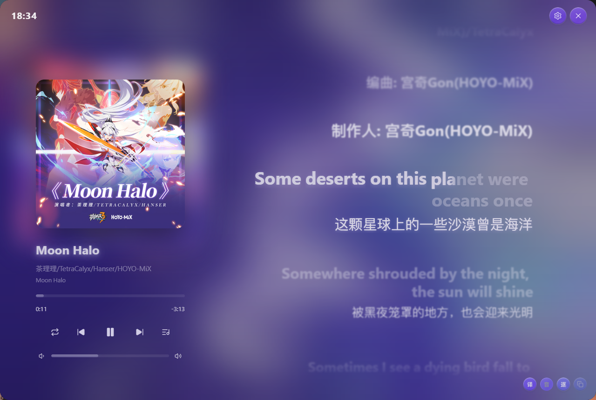
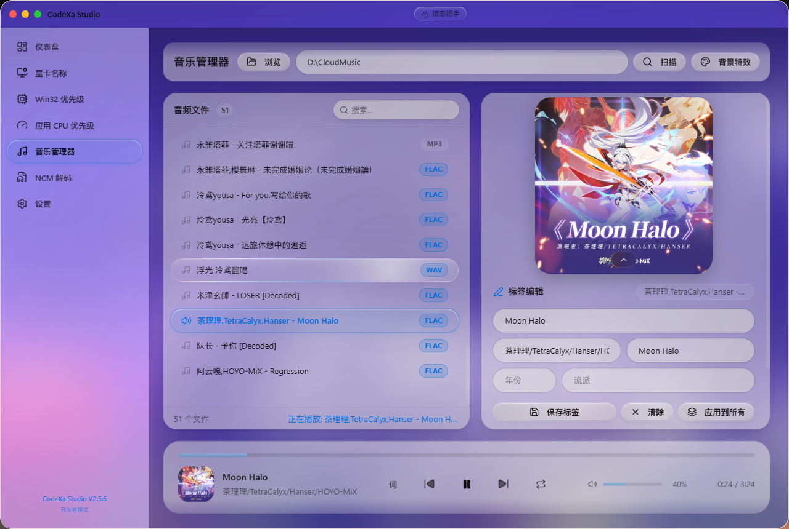

<p align="center">
  
</p>

<h1 align="center">CodeXa Studio</h1>

<p align="center">
  <b>现代化 Windows 音乐管理器 & 系统工具箱</b>
</p>

<p align="center">
CodeXa Studio 是一个基于 Electron + React + .NET 构建的现代化 Windows 桌面应用，专注于本地音乐管理体验，同时集成常用 Windows 系统优化工具。
<br/>
提供音频标签编辑、歌词同步显示、专辑封面管理、播放器、网易云歌曲信息辅助以及系统优化等功能。
</p>

<p align="center">
  
  
  
  
  
</p>

---

## 📸 预览

<p align="left">
  <b>🎵 音乐管理器</b><br/>
  <b> </b><br/>
  
</p>

<p align="left">
  <b>⚙ Win32 优先级分离</b><br/>
  <b> </b><br/>
  
</p>

---

## ✨ 功能

### 🎵 音乐管理

- 🎼 MP3 / FLAC / OGG / M4A 标签编辑
- 🏷 标题、艺术家、专辑、年份等元数据编辑
- 🖼 专辑封面查看、替换、提取
- 📝 LRC 歌词解析与同步显示
- 🍎 Apple Music 风格歌词动画
- ▶️ 内置音乐播放器
- 🔍 本地音乐快速搜索
- ☁️ 网易云歌曲信息匹配
- 📂 批量管理音乐文件
- 🎧 高质量本地音乐浏览体验

### ⚙ Windows 系统工具

- Win32 优先级分离
- 应用 CPU 优先级（IFEO）
- 注册表备份与恢复
- 系统仪表盘
- 操作历史记录

### 🎨 设计亮点

- Liquid Glass 设计语言，多主题切换
- Apple Music 风格歌词动画
- 本地数据存储，不上传用户音乐
- 持续更新更多音乐管理功能

---

> 完整源码结构见仓库 [AGENTS.md](AGENTS.md)。

---

## 🚀 快速开始

```bash
# 安装依赖
npm install

# 开发模式
npm run dev

# 构建
npm run build
```

### 环境要求

* Windows 11
* Node.js 22+
* .NET 10 SDK
* 管理员权限（部分系统功能需要）

---

## 🛠 技术栈

* React 19
* TypeScript 6
* Electron 42
* .NET 10
* Tailwind CSS 4
* Framer Motion
* C#
* Python（部分工具模块）

---

## ❤️ 鸣谢

本项目使用、参考或受到以下优秀开源项目启发：

| 项目                                       | 用途                 |
| ---------------------------------------- | ------------------ |
| amll-dev/applemusic-like-lyrics          | Apple Music 风格歌词组件 |
| SUlTlUS/refined-now-playing-netease-next | 网易云 Now Playing UI |

感谢所有开源作者以及社区贡献者。

---

## 📄 开源协议

本项目采用 **GNU Affero General Public License v3.0（AGPL-3.0）**。

你可以：

* Fork 本项目
* 学习源码
* 修改源码
* 二次开发
* 提交 Pull Request

但必须遵守 AGPL-3.0 协议，包括但不限于：

* 保留原始版权声明
* 保留 License 文件
* 修改后的版本同样采用 AGPL-3.0
* 基于本项目提供网络服务时，应公开对应源码

详细内容请查看仓库中的 **LICENSE** 文件。

---

## ⚠️ 免责声明

CodeXa Studio 是一个开源软件，仅供学习、研究及个人合法用途使用。

### 关于音乐功能

* 本项目不会破解任何音乐平台版权保护。
* 本项目不提供任何盗版音乐资源。
* 本项目不内置任何音乐下载服务。
* 所有歌曲、歌词、封面及相关资源版权均归原版权所有者所有。
* 网易云音乐相关功能依赖第三方公开 API，仅用于获取公开可访问的信息。
* 请遵守所在地法律法规及相关平台用户协议。

### 关于系统功能

本项目包含部分 Windows 系统配置及注册表修改功能。

请在操作前做好必要的数据及注册表备份。

开发者不对因误操作、系统环境差异、第三方软件冲突等原因导致的：

* 数据丢失
* 系统异常
* 软件冲突
* 硬件损坏
* 其他直接或间接损失

承担任何责任。

使用本软件即表示你已阅读并同意上述声明。

---

<p align="center">
Made with ❤️ by <a href="https://github.com/YOU5A">YOU5A</a>
<br/>
如果觉得项目不错，欢迎 ⭐ Star 支持一下！
</p>
